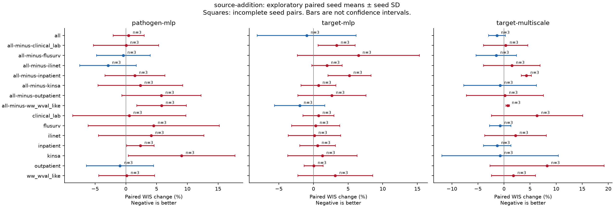
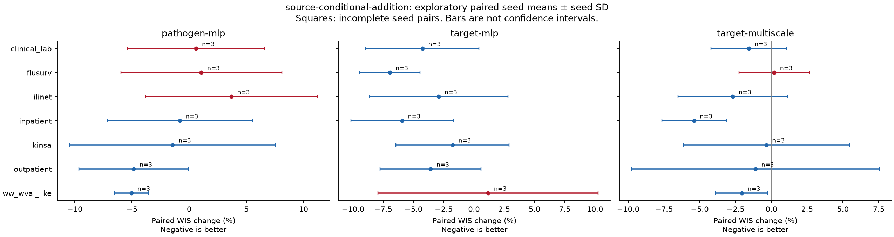
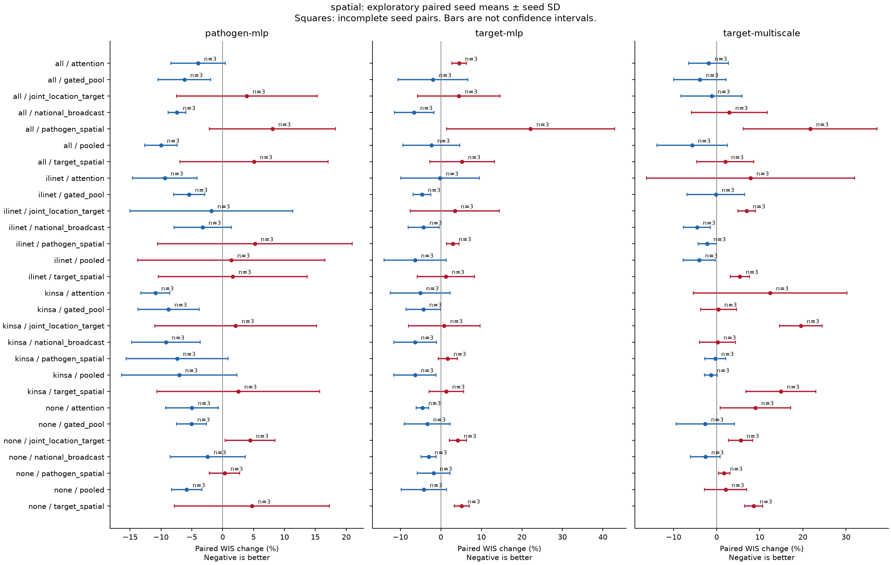
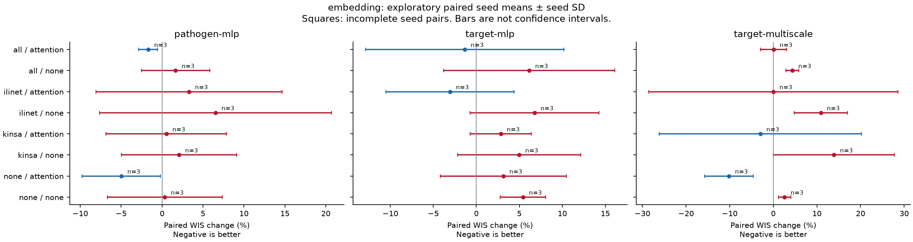

# Covariates and information sharing: matched research report

**COMPLETE.** 468/468 planned seed runs represented in this ranking. Expected seeds: 42, 43, 44. Evaluation uses 256 samples.

All effects compare existing matched seeds; an unfinished candidate or control contributes no pair. Missing pairs are listed explicitly. Partial comparisons may contain different seed subsets and should not be ranked against one another.

Negative WIS change favors the candidate. Source additions compare against no external covariates with the same backbone, exchange and embedding. Conditional source additions compare all sources against all-minus-one, so negative means the omitted source helps when added back. Spatial effects compare against no exchange with sources and embedding fixed. Embedding effects compare 8 dimensions against zero with everything else fixed.

Percent effects are means of seedwise ratios, not ratios of separately averaged scores. Bars show across-seed standard deviations, not confidence intervals. Three seeds describe optimization variability; these reused historical seasons are exploratory development data. Source conclusions are conditional on the operational availability assumptions inferred from 2025–26: actual vintages are preferred, but missing historical vintages can use finalized proxies under assumed availability. This can introduce revision optimism, particularly for Kinsa and other short archives. Interpret effects alongside the [study availability policy](../../design/b2-direct-research.md#reporting-availability-and-support) and source-specific substitution counts; this is not a fully reconstructed real-time backtest.

[All planned comparisons](comparisons.csv) · [Run completeness](run_status.csv) · [Pair completeness](comparison_status.csv) · [Paired seed scores](paired_seed_scores.csv) · [Paired means and seed dispersion](matched_summary.csv) · [Target-season coverage](target_season_coverage.csv) · [Provenance](research-provenance.json).

The paired tables decompose overall, states/DC and US scores, season composites, target means, and target-by-season scores. Target means are diagnostics and must not be averaged to reconstruct the season-weighted combined score. Available benchmark targets differ between seasons.

